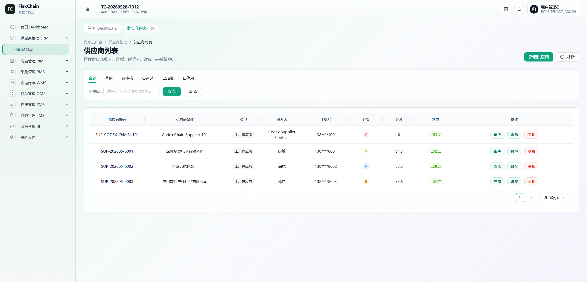

# FlexChain ???????

FlexChain ????????????? SaaS ?????/?????????????????????????????????????????????RBAC ?????????????????????????

????????????????????????????BI?????????????????????????????????? Agent ??????????

## ????

### ?? Dashboard


### ?????



## ????

- ?? Dashboard??? GMV?????????????????
- SRM ????????????????????????????
- PIM ?????SPU/SKU????????????????????
- PMS ????????????????????????????
- WMS ?????????????????????????
- OMS ???????????????????????????
- TMS ????????????????????????
- FMS ???????????????????????????
- BI ?????KPI??????????????????
- System ??????????????????????????

## ???

- React 19
- TypeScript
- Vite
- Ant Design 6
- TanStack Query
- React Router
- Zustand
- Axios
- ECharts
- ESLint

## ????

```text
.
|-- public/                 ????
|-- scripts/                ???????????
|-- src/
|   |-- api/                ??????????
|   |-- components/         ????
|   |-- data/               ?????????????
|   |-- hooks/              ?? Hook
|   |-- pages/              ?????????
|   |-- routes/             ????????
|   |-- store/              ??????
|   |-- types/              TypeScript ??
|   `-- utils/              ???????????
|-- package.json
|-- vite.config.ts
`-- tsconfig.json
```

## ????

### ????

- Node.js 20+
- npm
- ??? FlexChain ???????

### ????

```powershell
npm install
```

### ????

```powershell
npm run dev
```

Vite ????? `vite.config.ts` ???????????????????????

### ??

```powershell
npm run build
```

### ????

```powershell
npm run lint
```

## ??? SQL ????

???????? `supplychain-10` ???????????????????????????????

```sql
source sql/00_full_schema.sql;
source sql/01_demo_seed.sql;
```

???????

1. `00_full_schema.sql`??? `supplychain_dev` ????????????
2. `01_demo_seed.sql`???????????????????????????????????
3. ??????????
4. ????????

???`00_full_schema.sql` ?? `DROP TABLE IF EXISTS`???????????????????????????

## Mock ??

???????????????? mock ??????????????????

```env
VITE_ENABLE_MOCK_FALLBACK=true
```

??????????????????????? mock fallback??????????????????????????

## ????

```powershell
npm run audit:buttons
npm run audit:rbac
npm run audit:db
npm run audit:chain
npm run audit:purchase-chain
```

?????

- `audit:buttons`?????????????????????????????
- `audit:rbac`??????????????????????
- `audit:db`????????????? SQL ??????
- `audit:chain`??? OMS -> WMS -> TMS ???????
- `audit:purchase-chain`??? SRM -> PMS -> WMS -> FMS ???????

## ????

- ??????????????????? code???????????? Integer ???
- ???????????????????????????????????
- ????????????????
- ???????????
- ?????????
- ??? mock/demo ???????????
- ????????????????????

## ??

????????????? token ???
